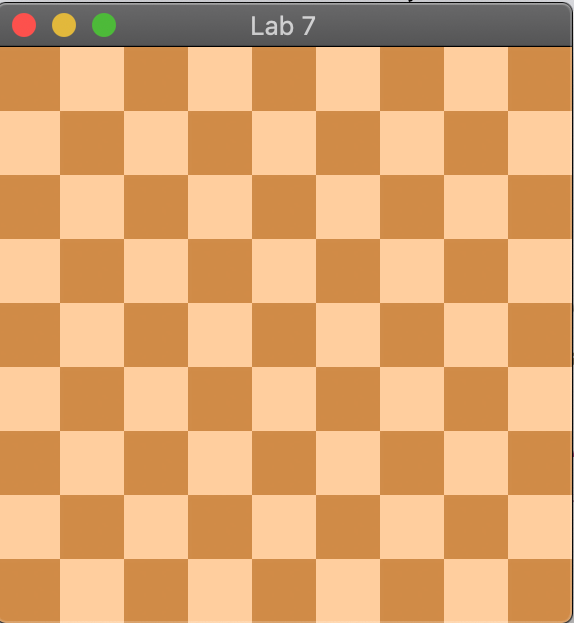

# Lab 7: GUI Programming
This lab7 will cover the following topics:
* JavaFX Canvas, Scenes, VBox

## JavaFX background
JavaFX is a GUI framework which uses a theatre metaphor to represent the application. A single stage can have different scenes, which themselves consist of panes holding nodes.  

Typically, a JavaFX program is structured as follows:
1. Define a class extending the `Application` class
2. Override the abstract `start` method inherited from `Application`
3. In the start method:
    * Prepare a scene graph
    * Construct a scene, with the root node of the scene graph
    * Set up the stage with the constructed scene
4. Define a main method to launch the application

In this lab7, we will have a VBox as the root node, containing a single Canvas node. This itself is part of the setboardScene, which is passed to the primaryStage in the start function.


### Load images

There are several ways to load img file to Image, here we show two of them.

```java
try {
    image = new Image(Main.class.getResource("/package/img.png").toURI().toString());
    } catch (URISyntaxException e) {
    e.printStackTrace();
    }
```

or 

```java
image = new Image("file:src/package/img.png");
```

**NOTE**: Be carefull of the **relative** path. 

- `Main.class.getResource("/package/img.png")` uses `src` as root dir, so you should use relative path.
- Using `file:src/package/img.png`, image will be searched in classpath, so you need to navigate the relative path from `src`.


You can check this documents:[Image API](https://docs.oracle.com/javase/10/docs/api/javafx/scene/image/Image.html) to get deeper understanding.


### Canvas

You will use the `Canvas` class extensively in this lab7 and in PA2. For your reference, the documentation is provided [here](https://docs.oracle.com/javafx/2/canvas/jfxpub-canvas.htm). 

You may find the following functions useful:

* getGraphicsContext2D

  ```java
  GraphicsContext gc = canvas.getGraphicsContext2D();
  ```

* setHeight/setWidth

  ```java
  canvas.setHeight(double var1);
  canvas.setWidth(double var1);
  ```

* drawImage

  ```java
  gc.drawImage(Image var1, double var1, double var2);
  ```


## How to set up

You need to add javafx-sdk/lib to project library. 

The javafx-sdk and installation instruction can be found in PA2 `readme.md`.


## What you need to do
Load the two image files, and generate a chess board based on the two images. E.g. for an 9x9 chess board scene, the following output should be generated:  
  

There is **no need** to handle invalid (non-positive) boardSize. 

This is in **preparation** for an important component of PA2 (`gui/controllers/Render.java#renderChessBoard` method). 


## Submisson to CASS

1. Zip the project, and submit it to CASS
2. Two screenshots, one for 9x9 chessboard, one for 4*4 chessboard. Put the screenshots in one single WORD/PDF file and submit it to CASS

## Tips
* To load image, you need to check the [Image API](https://docs.oracle.com/javase/10/docs/api/javafx/scene/image/Image.html)
* You may need to get the graphics context object of the canvas to draw images

